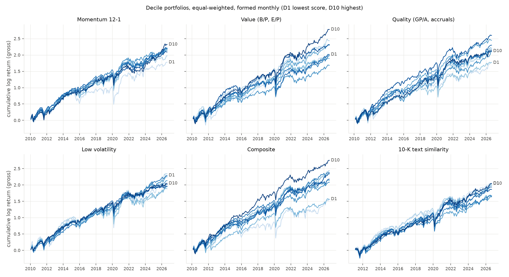
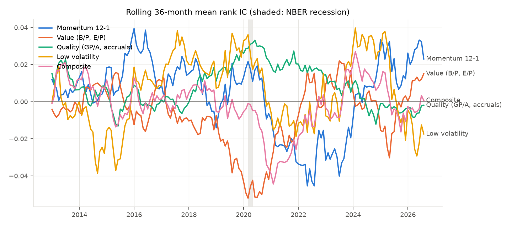
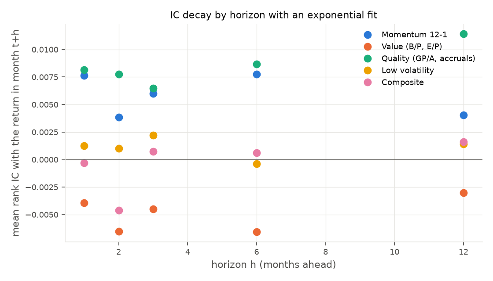
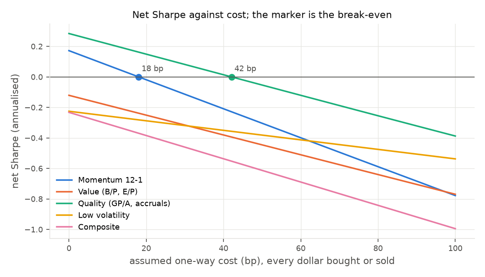

# Cross-Sectional Factor Backtester

Point-in-time equity factor research for US large caps, 2010–2026, with
costs, signal decay and overfitting control.

> **Status: built and run.** Every number below comes from
> `reports/results.md`, which `uv run backtester report` writes from saved
> runs and the specification log; nothing is typed from memory. The brief
> is [here](Project%20Outline/01_Factor_Backtester.docx).

## The test that matters

```python
def test_asof_join_excludes_filing_after_signal_date() -> None:
    # A 10-K for FY2019 filed on 2020-02-29 (the month-end itself) and a
    # 10-K for FY2018 filed a year earlier.
    v = _values(
        (1, date(2018, 12, 31), date(2019, 2, 20), 100.0),
        (1, date(2019, 12, 31), date(2020, 2, 29), 200.0),
    )
    out = fx.asof_join(_panel(), v, buffer_days=1).sort("month")
    got = dict(zip(out["month"], out["value"], strict=True))
    assert got[date(2020, 1, 31)] == 100.0  # only FY2018 exists
    assert got[date(2020, 2, 29)] == 100.0  # filed today: NOT available yet
    assert got[date(2020, 3, 31)] == 200.0  # filed 02-29 + 1 day <= 03-31
```

[tests/test_fundamentals.py](tests/test_fundamentals.py). Every fundamental
used at month-end *t* was **filed** on or before *t − 1 day*, joined as-of
filing date, never keyed on period end; the first-filed value wins over
later amendments (`test_first_filed_value_beats_later_amendment`); an
amendment for an older period arriving after a newer filing is ignored.
These are three of nine invariants in [CLAUDE.md](CLAUDE.md), each with a
test written before the code it guards.

## What this is

A monthly-rebalanced factor backtester that treats **data honesty as the
deliverable, not the returns**. It takes point-in-time fundamentals from SEC
filings, a reconstructed historical universe, and daily prices, and produces
decile and long–short portfolios for value, momentum, quality and low
volatility — with costs, turnover and statistical tests on top. The engine
takes any `(month, ticker, z)` frame, so a new signal is a dictionary entry.

## The question

Do value, momentum, quality and low volatility earn a premium on a universe an
outsider can verify, over 2010–2026?

- How much paper return survives turnover, spreads and a 1-day execution lag?
- How fast does each signal decay, and what rebalance frequency follows?
- How much of the result is multiple-testing luck, once N is counted honestly?

**The expected answer was modest, and it is.** No factor gets near a Sharpe
of 1; the composite's net Sharpe of 0.34 deflates to a 14% probability of
beating the best of 74 logged trials by luck.

## Results

Window 2010-01 to 2026-08, 200 monthly formations. Equal-weighted deciles,
signals z-scored within sector, 1-day execution lag, **10 bp one-way cost on
every dollar bought or sold**. Long–short is decile 10 minus decile 1.

| Factor | Gross ann. | Net ann. | Vol | Sharpe (net) | DSR | Max DD | Turnover | Mean IC | IC t-stat | Break-even cost |
|---|---|---|---|---|---|---|---|---|---|---|
| Momentum 12-1 | 2.2% | 0.7% | 15.8% | 0.05 | 0.01 | −56% | 0.62 | 0.007 | 0.6 | 15 bp |
| Value (B/P, E/P) | 5.3% | 4.6% | 9.2% | 0.50 | 0.34 | −22% | 0.28 | 0.011 | 1.4 | 80 bp |
| Quality (GP/A, accruals) | 2.1% | 1.4% | 8.5% | 0.17 | 0.04 | −24% | 0.26 | 0.009 | 1.5 | 33 bp |
| Low volatility | −4.1% | −4.7% | 18.9% | −0.25 | 0.00 | −71% | 0.24 | 0.003 | 0.2 | none (loses gross) |
| Composite | 5.9% | 5.0% | 14.5% | 0.34 | 0.14 | −28% | 0.40 | 0.018 | 1.9 | 62 bp |
| 10-K text similarity | 0.8% | 0.1% | 7.3% | 0.01 | 0.01 | −29% | 0.31 | 0.003 | 0.6 | 11 bp |

**DSR** is the deflated Sharpe of Bailey and López de Prado: the probability
that the net Sharpe exceeds the expected maximum of *N* random trials with
the same dispersion, adjusted for skew and kurtosis. *N* = 74 is the row
count of [reports/specifications.csv](reports/specifications.csv), where
every run — base, sensitivity, diagnostic, and the two broken first attempts
at momentum — is logged. **Break-even cost** is the one-way cost at which
the mean net return is zero.

What the table says, factor by factor:

- **Momentum** is UMD (β 0.91, t 15.7, R² 0.66) and UMD earned nothing in
  this window. Turnover of 0.62 a month puts its break-even at 15 bp.
  Holding for 3–12 months instead of 1 raises the net Sharpe to 0.18–0.23
  by cutting turnover, at the price of tracking UMD less closely.
- **Value** is the one that worked, and not the way the brief expected. Net
  Sharpe 0.50, Fama-MacBeth t 3.2, break-even 80 bp. Its attribution alpha
  of 4.9% (t 2.4) after Mkt, HML, UMD and RMW is the number to distrust
  first. It is not the earnings-yield half: sector-neutral B/P on its own
  has an alpha of 4.5% (t 2.3) with an HML loading of only 0.26, and
  sector-neutral E/P 4.6% (t 1.9) with an HML loading of −0.12. The "alpha"
  is what sector neutralisation leaves after HML, which is not
  sector-neutral — a within-sector value premium that the French factor
  does not price, or a data-coverage artefact in the early years; the
  coverage split below says 0.48 on the well-covered months against 0.50
  on all, which argues for the former. Cap-weighted it drops to 0.30.
- **Quality** is small (net Sharpe 0.17) and 0.42 cap-weighted; accruals
  carry it, gross profitability alone is negative in this universe.
- **Low volatility** loses 4.1% a year gross as a long–short. Its
  attribution is the brief's prediction: market beta −0.65 (t −10.5) and
  RMW 0.94 (t 8.2), with alpha of 1.1% (t 0.4). It is a short-beta,
  long-profitability position, and shorting beta lost for sixteen years.
- **Composite** (all six signals) nets 0.34, 0.64 held for 12 months.
- **10-K text similarity** — long the names whose annual report changed
  least year on year, Cohen, Malloy and Nguyen's "Lazy Prices" — earns
  nothing here: 0.8% gross, 0.1% net, alpha 1.1% (t 0.6), R² 0.02 on the
  four French factors, so it is at least not a repackaging of them. Jaccard
  instead of cosine gives 0.05 net; cap-weighting and a 3-month hold go
  negative. The paper's effect sits in small caps and in the short leg, and
  this is an S&P 500 long-short over 2010-2026. It is in the table because
  the point of building it was the data path (next section), not the return.

Four charts, from [reports/figures/](reports/figures/):






Signal decay: momentum's IC halves in about 15 months on the exponential
fit but is small at every horizon; value, quality and the composite do not
decay within 12 months at all — their IC at h=12 is as high as at h=1 —
which is why holding them for 6–12 months costs nothing in return and
saves most of the turnover. The full tables, including net Sharpe at 0, 5,
10, 25 and 50 bp, the cap-weighted and holding-period variants, and the
Fama-MacBeth premia, are in [reports/results.md](reports/results.md).

## Validation bar

The pipeline is considered wrong until the long–short series clear this:

| Series | Must correlate with | Threshold | Result |
|---|---|---|---|
| Momentum long–short | French **UMD** | > 0.7 | **0.79** pass (0.85 without sector neutralisation) |
| Value long–short | French **HML** | > 0.7 | 0.25 fail as reported; see below |
| Quality long–short | French **RMW** | > 0.7 | 0.07 fail as reported; see below |

The reported value and quality factors are sector-neutral composites of two
signals each, and HML and RMW are neither, so their correlation was never
going to reach 0.7 and it is not the test of the join. The test of the join
is to build French's factor the way French does — one raw signal, no sector
neutralisation, cap-weighted top third minus bottom third — and compare it
with the **big-cap half** of his factor, which he also publishes, because HML
and RMW are half small-cap and this universe has none (French's own big-cap
leg correlates only 0.92 with full HML over the window).

| Replication | vs full factor | vs big-cap leg | from 2016 |
|---|---|---|---|
| B/P, cap-weighted terciles | 0.65 | **0.74** | **0.89** |
| Pre-tax income / FY book equity, cap-weighted terciles | 0.27 | 0.45 | 0.62 |

The book-equity join clears the bar against the like-for-like series. The
profitability replication does not, and the by-period numbers say why: it
is 0.07 in 2010–12, 0.31 in 2013–15, 0.67 in 2016–18 and 0.74 in 2019–21,
tracking XBRL coverage (FY2009 10-Ks cover 41% of the universe; a
profitability line that banks and insurers report is missing until the
pre-tax income fallback). That is a data-coverage failure in the early
years, not a join error, and it is left as a fail rather than tuned.

## Data

| Need | Source | Note |
|---|---|---|
| Universe history | Wikipedia constituents + changes tables | Membership intervals per ticker; cross-checked month by month against the [fja05680/sp500](https://github.com/fja05680/sp500) daily list, 98.4% agreement |
| Fundamentals | SEC Financial Statement Data Sets | 70 quarterly zips 2009q1–2026q2; **filing date is the key**; 16 concepts via an ordered tag map |
| Prices | yfinance | Stooq is behind a JavaScript wall as of 2026-09. Delisted names are absent: **14.6% of universe-months**, 31% in 2010 falling to 0% |
| Sector map | SIC from the filings | 11 GICS-like buckets by hand; 84.5% agreement with Wikipedia's GICS on current members |
| Benchmarks | Ken French data library | Mkt, SMB, HML, RMW, CMA, UMD, and the six size × B/M and size × OP portfolios for the big-cap legs |
| Risk-free | French RF; FRED DGS1MO kept | Long–short spreads need none |
| 10-K text | EDGAR primary documents, indexed from the FSDS `sub.txt` | One gzip per original 10-K; **filing date is the SEC's**; scored by cosine/Jaccard against the prior year's filing (Cohen, Malloy and Nguyen 2020). Not company websites: no timestamp, restatements overwrite in place, delisted names vanish. Not transcripts: not filed, no point-in-time archive without a vendor. No language model: a model trained after the filing knows the outcome (invariant 10) |

**Known limitations, stated up front.** The S&P 500 restriction is a
compromise forced by free data — 496–504 names at every month-end and 818
unique names over the window (the brief's ~1,100 was high). Survivorship in
the *universe* is handled by reconstructing membership month by month; the
*prices* of names that were acquired or failed are largely missing from
yfinance, and that is the survivorship that remains: the "with and without"
table in `results.md` gives every factor on the 129 months from 2015-12
where the price gap is under 20% — value 0.48 against 0.50 on all months,
quality 0.34 against 0.17, momentum −0.03 against 0.05. Fundamentals coverage is 39% of members in 2010 and 86%
in 2023. A Russell 3000 version needs paid coverage of delisted names and
their filings.

Every hand-verified thing lives in [data/checks/](data/checks/README.md)
with its evidence in the row.

## What did not work

Kept as a first-class section, per the brief.

- **Wikipedia's `Date added` column is not an index-addition date for
  long-standing members.** Sempra "2017", T. Rowe Price "2019", Dominion
  "2016", Humana "2012", Freeport "2011", Johnson Controls "2010" — all are
  corporate-event dates on names in the index since the 1990s, and every
  Wikipedia-derived dataset repeats them. Trusted only before 2010; in-window
  it is adjudicated by the cross-check and each decision logged.
- **The changes table cannot express share-class events.** Google's 2014
  class C distribution is "GOOGL added" with no removal, so a backwards walk
  loses Google before 2014. Names added under one ticker and removed under
  another (UA→UAA, KORS→CPRI, JOYG→JOY) fall to an unknown start. Four
  override rows with evidence; the walk was not made cleverer.
- **Stooq no longer serves data to a script**, so the delisted names the
  brief hoped to recover from it are simply absent. yfinance is worse than
  absent for them: it stitches the acquired company's history onto whatever
  penny stock later reused the symbol (BEAM is Beam Therapeutics; 43 tickers
  dropped), prints TIE at 11,700 on a 2011 month-end (413 bad prints
  dropped), and returns a corrupt series for five names. Three logged
  cleaning rules, on price ratios rather than signed returns because a fall
  can never exceed −100%.
- **The first momentum run correlated 0.04 with UMD.** Uncleaned prices
  (above) and a validation join that compared the formation month with the
  same month's UMD, when the return is earned the month after. Both runs
  are in the specification log.
- **Wikipedia's CIK for ExxonMobil is a 2026 entity with no filings.** A
  constituents CIK with no history falls back to the company name.
- **A few large filers report the balance-sheet share count in the wrong
  units** (RTX, CMG), and Berkshire reports class-A equivalents against a
  class-B price. Market cap uses the diluted weighted-average count; a cap
  under a billion dollars is dropped and listed.
- **`OperatingIncomeLoss` is not reported by banks or insurers**, which
  left profitability without financials and its French replication at 0.31.
  Pre-tax income over fiscal-year book equity is the closest reported line and lifted it to 0.45 — still
  short, for the coverage reasons above.
- **Value and quality do not validate against HML and RMW as reported**, and
  the fix was not to change the reported factors until they did; it was to
  replicate French separately and say which half of the gap is
  construction and which half is data.
- **The brief's cost formula charges half the cost.** `r_net = r_gross −
  c·TO` with `TO = ½Σ|Δw|` and `c` one-way charges c per unit of two-way
  volume. Here every dollar bought and sold pays c: `r_net = r_gross −
  2c·TO`. Break-evens are quoted under that stricter convention.
- **The 10-K text factor is flat, and the question that led to it was
  answered on the way.** Asked whether company websites, transcripts and
  annual reports would be a richer source than SEC filings: no, for the
  backtest. A website has no filing timestamp (invariant 1), a restated
  PDF overwrites the original in place (invariant 2), a delisted member's
  site is gone (invariant 3), and transcripts are not filed at all. The
  text comes from EDGAR, one primary document per original 10-K (10,339
  of 10,339 in the index; one was re-numbered by EDGAR and found by form
  and filing date), and is scored by two deterministic similarities. A
  language-model score was ruled out and made invariant 10: a model
  trained after the filing knows what happened next, and no test on the
  timestamps would catch it. Item 1A / Item 7 extraction and the 8-K
  earnings release are the next steps if the text route is pursued.
- **Not done:** trailing-twelve-month flows from 10-Qs (annual 10-K values
  are used, updated at filing date); a delisting-return adjustment beyond
  closing a position at its last print.

## Running it

```bash
uv sync
uv run pytest                                   # 83 tests
uv run backtester fetch --step universe --as-of 2026-09-11
uv run backtester fetch --step prices     --as-of 2026-09-11
uv run backtester fetch --step benchmarks --as-of 2026-09-11
uv run backtester fetch --step fundamentals --as-of 2026-09-11   # ~2.5 GB
uv run backtester fetch --step text --as-of 2026-09-14           # ~10,300 10-K documents, resumable
uv run backtester build --step universe && uv run backtester build --step prices
uv run backtester build --step benchmarks && uv run backtester build --step fundamentals
uv run backtester build --step text && uv run backtester run --factor text_change
uv run backtester run-all && uv run backtester sensitivities && uv run backtester report
```

Raw downloads are never overwritten and every one is in
`data/raw/manifest.json` with its sha256. Every knob is in `config.toml`.

## Layout

```
config.toml                    every knob; sensitivity tables loop over this
src/backtester/
  universe.py                  month-by-month S&P 500 membership, cross-checked
  prices.py                    daily prices, cleaning, monthly returns with lag
  benchmarks.py                French factors and their big-cap legs, FRED
  fundamentals.py + tag_map.toml   SEC filings, first-filed, as-of join, caps
  sectors.py                   CIK matching, SIC -> 11 buckets
  text.py                      10-K text from EDGAR, year-on-year similarity, invariant 10
  signals.py                   signals, winsorise, sector z-score, composite
  portfolio.py                 the engine: deciles, drift, turnover, costs, spec log
  stats.py                     IC, decay, Fama-MacBeth, Newey-West, DSR, attribution
  run.py                       one factor end to end; the loops; French replications
  report.py                    four charts and results.md
data/checks/                   committed evidence, one file per question
reports/figures, reports/results.md, reports/specifications.csv, reports/methodology.pdf
```

Build order was momentum first — it needs no fundamentals — validated
against UMD before the SEC data was touched. [PLAN.md](PLAN.md) has the
phases and gates.
